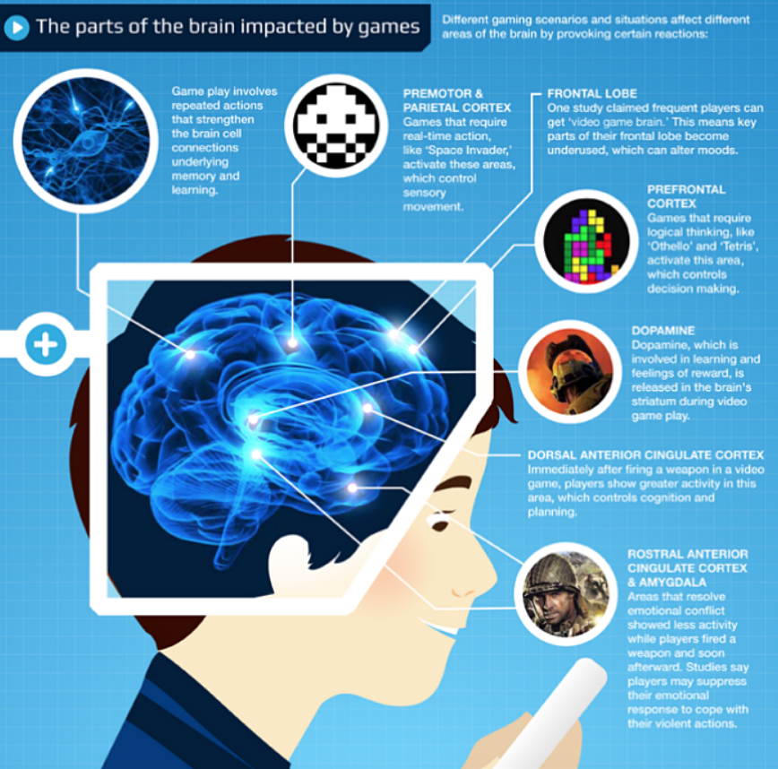
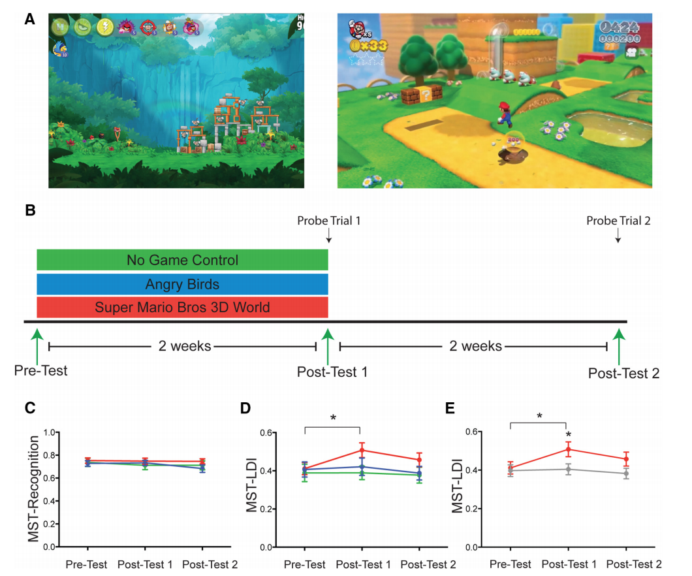

# Playing Video Games Improves Memory

## Brain Overview:
Not part of research paper, but thought it looked good.

http://www.onlineuniversities.com/

   
## Virtual Environmental Enrichment through Video Games Improves Hippocampal-Associated Memory
source: http://www.jneurosci.org/content/jneuro/35/49/16116.full.pdf 

### Paper Overview

For their study, they were interested in the effect of video games on the hippocampus, the region of the brain that is associated with the formation of memories; specifically, it is responsible for consolidating short-term memories into long-term ones. 

>***Hippocampal Function***
>
>The hippocampus is a small organ located within the brain's medial temporal lobe and forms an important part of the limbic system, the region that regulates emotions. The hippocampus is associated mainly with memory, in particular long-term memory. The organ also plays an important role in spatial navigation. 
Source: https://www.news-medical.net/health/Hippocampus-Functions.aspx 

In order to investigate this effect, college students were asked to play one of two games for 30 minutes per day over the course of two weeks. Thirty-nine of the participants were self-described regular gamers, and 29 were non-gamers.

The was the well-known mobile game "Angry Birds," which involves a passive 2D landscape that the players cannot wander through. The second game was "Super Mario 3D World," a WiiU video game that players can, unsurprisingly, move around in a 3D landscape. A control group – those who did not play any games throughout – were included.

Before and after the two-week-long video gaming session, the students were asked to take memory tests (***MST - LDI*** test) that are known to directly engage their hippocampi. In the first, they were given a series of photographs of everyday objects to study. After a short time interval, they were shown the same objects again, interspersed with images of other objects, and altered images of the original objects.

The participants were requested to correctly ascertain which objects belonged to which of the three categories. In the second test, dots and lines flashed up on a screen, and the students were asked to correctly recall how many appeared shortly afterwards.

The researchers found that there was no improvement in memory recall when it came to the 2D gaming group. In terms of the dot and line test, the 3D group didn’t show any improvement either, but when it came to the object identification test, the 3D group of gamers showed a 12 percent average score increase. This is roughly the amount that an average person’s memory recall ability decreases between the ages of 45 and 70.

Source: http://www.iflscience.com/brain/3d-videogames-shown-improve-memory-formation/

### Preparing to Test Subjects

### Results of Experiment

source:[16116.full.pdf](http://www.jneurosci.org/content/jneuro/35/49/16116.full.pdf)
